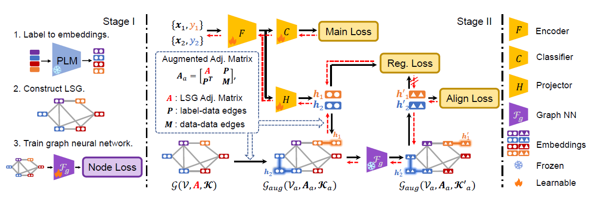

<div align="center">    


# Language Semantic Graph Guided Data-Efficient Learning

[](https://arxiv.org/abs/2311.08782)
[](https://neurips.cc/) 

Wenxuan Ma, [Shuang Li*](https://shuangli.xyz), Lincan Cai, Jingxuan Kang

</div>

This repository provides the official code for the NeurIPS 2023 paper [Language Semantic Graph Guided Data-Efficient Learning](https://arxiv.org/abs/2311.08782) (LSG). 



## Abstract

Developing generalizable models that can effectively learn from limited data and with minimal reliance on human supervision is a significant objective within the machine learning community, particularly in the era of deep neural networks. Therefore, to achieve data-efficient learning, researchers typically explore approaches that can leverage more related or unlabeled data without necessitating additional manual labeling efforts, such as Semi-Supervised Learning (SSL), Transfer Learning (TL), and Data Augmentation.  

However, the significance of additional knowledge contained within labels has been largely overlooked in research. In this paper, we propose a novel perspective on data efficiency that involves exploiting the semantic information contained in the labels of the available data. Specifically, we introduce a **Language Semantic Graph (LSG)** which is constructed from labels manifest as natural language descriptions. Upon this graph, an auxiliary graph neural network is trained to extract high-level semantic relations and then used to guide the training of the primary model, enabling more adequate utilization of label knowledge. Across image, video, and audio modalities, we utilize the LSG method in both TL and SSL scenarios and illustrate its versatility in significantly enhancing performance compared to other data-efficient learning approaches. 


## Paradigm Introduction

LSG is a simple data-efficient learning paradigm that includes three steps:

1. Obtain text embedding of labels via pre-trained language model (PLM).
2. (The first training stage, lightweighted.) Consturct Language Semantic Graph (LSG) and correspondingly train a GCN to model the semantic relationship between embedded labels.
3. (The primary training stage.) Train the model with main task loss (i.e., CrossEntropy),
and the two proposed alignment loss that leverage LSG and the pretrained GCN to learn label semantic information.

## Dataset

This repository is build upon [Self-Tuning](https://github.com/thuml/Self-Tuning), and the three dataset involved would be automatically downloaded once the code in run. Thanks for their amazing works.

If the datasets are not automatically downloaded, they can be manually downloaded as follows.

<details>
  <summary>Aircraft</summary>
  Create directory `./lsg_training/Aircraft`.
  Download image_list.zip from [here](https://cloud.tsinghua.edu.cn/f/449157d27987463cbdb1/?dl=1), train.tgz from [here](https://cloud.tsinghua.edu.cn/f/06804f17fdb947aa9401/?dl=1) and test.tgz from [here](https://cloud.tsinghua.edu.cn/f/164996d09cc749abbdeb/?dl=1).
  Extract them, and the directory will look like:

  ```
  ./lsg_training/Aircraft
  ├── train
  ├── test
  ├── image_list
  │   ├── train100.txt
  │   ├── train50.txt
  │   ├── train30.txt
  │   ├── train15.txt
  │   ├── test.txt
  ```
</details>

## Training 

### Step 1: Obtain label embeddings via Pretrained Language Models.

Codes involving obtaining label embeddings are in "./label_embedding/". Run the following command to obtain text embeddings.

You need to modify the following things in the code:

- classnames: List
- save_name: str 

```python
cd label_embedding

# Bert-Large
python text_embedding.py

# GPT-2
python text_embedding_gpt.py

# CLIP ViT-Large
python text_embedding_clip.py
```

### Step 2: Construct the LSG and train a GCN model for each task.

Codes involving training the GCN and the main model are in "./lsg_training/". Run the following command to train GCNs:

```python
cd lsg_training
sh train_stage1.sh
```

### Step 3: Use the LSG and the trained GCN to train the main model.

Run the following command to train the main model:

```python
sh train_stage2.sh
```


## Citation

If you find this project useful, please consider citing:

```
@article{ma2023language,
  title={Language Semantic Graph Guided Data-Efficient Learning},
  author={Ma, Wenxuan and Li, Shuang and Cai, Lincan and Kang Jingxuan},
  journal={Advances in Neural Information Processing Systems},
  year={2023}
}
```

## Contact

If you have any questions about our code, feel free to contact us or describe your problem in Issues.

Email address: wenxuanma@bit.edu.cn, shuangli@bit.edu.cn

<div align="right">
<b><a href="#overview">↥</a></b>
</div>